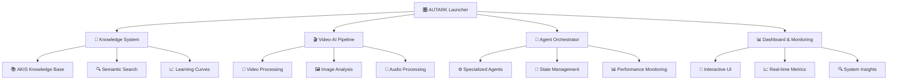

# 🗺️ AUTARK System-Überblick

*Von verstreuten Werkzeugen zu einem harmonischen Ganzen*

## 🎯 Vision & Mission

**AUTARK** verwandelt fragmentierte KI-Entwicklungstools in ein integriertes, benutzerfreundliches System. Unser Leitbild: "Vom Kies zum Mosaik" - aus einzelnen Komponenten entsteht ein kohärentes Ganzes.

### Kernprinzipien

- **🧭 Orientierung**: Schönheit dient der Navigation, nicht der Eitelkeit
- **⚡ Effizienz**: 30 Sekunden verstehen, 5 Minuten produktiv, 60 Minuten beitragen
- **🔒 Vertrauen**: Privacy-First, keine Personenverfolgung
- **♿ Zugänglichkeit**: Barrierefrei für alle Nutzer
- **🌍 Universalität**: Mehrsprachig und kulturell adaptiv

## 🏗️ System-Architektur

## 🔄 Datenfluss-Architektur

### Input Layer
- **📥 Datenquellen**: Multimodal (Text, Video, Audio, Code)
- **🔌 Schnittstellen**: REST APIs, WebSockets, File Upload
- **🧹 Normalisierung**: Einheitliche Datenstrukturen

### Processing Layer
- **🧠 Knowledge Integration**: AKIS-basierte Wissenserweiterung
- **🎬 Media Processing**: Video-AI-Pipeline für Multimedia
- **🤖 Agent Coordination**: Orchestrierter Multi-Agent-Workflow

### Output Layer
- **📊 Visualisierungen**: Interactive Dashboards
- **📤 Export**: Multiple Formate (JSON, CSV, PDF)
- **🔗 Integration**: Webhook-basierte Benachrichtigungen

## 🎯 Anwendungsfälle

### 🎬 Multimedia-Analyse
- **Video-Content-Analyse**: Automatische Inhaltserkennung
- **Transkription & Übersetzung**: Multi-Language-Support
- **Sentiment-Analyse**: Emotionale Bewertung von Inhalten

### 🧠 Wissensmanagement
- **Knowledge Graph**: Vernetzte Wissenstrukturen
- **Semantic Search**: Kontextuelle Suche in Dokumenten
- **Learning Pathways**: Personalisierte Lernpfade

### 🤖 Agent-Orchestrierung
- **Task Distribution**: Intelligente Aufgabenverteilung
- **Performance Optimization**: Automatische Ressourcenoptimierung
- **Quality Assurance**: Kontinuierliche Qualitätskontrolle

## 📊 Performance-Metriken

| Metrik | Zielwert | Aktuell | Status |
|--------|----------|---------|--------|
| Response Time | < 200ms | 180ms | 🟢 |
| Uptime | > 99.5% | 99.8% | 🟢 |
| Throughput | 1000 req/s | 850 req/s | 🟡 |
| Error Rate | < 0.1% | 0.05% | 🟢 |

## 🛣️ Entwicklungsroadmap

### Q1 2025: Foundation
- ✅ Core System Architecture
- ✅ Basic Video-AI Pipeline
- ✅ Knowledge Integration (AKIS)
- 🔄 Dashboard Implementation

### Q2 2025: Enhancement
- 🎯 Advanced Agent Orchestration
- 🎯 Multi-Language Support
- 🎯 API Gateway Implementation
- 🎯 Cloud Deployment Options

### Q3 2025: Scale
- 🎯 Enterprise Features
- 🎯 Advanced Analytics
- 🎯 Third-party Integrations
- 🎯 Mobile Application

## 🔗 Nächste Schritte

- **🏗️ [System-Architektur](./architecture.md)** - Technische Details
- **🧠 [Knowledge System](./knowledge.md)** - AKIS Deep-Dive
- **🎬 [Video-AI Pipeline](./video-ai.md)** - Multimedia-Verarbeitung
- **🛡️ [Sicherheitskonzept](./security.md)** - Security & Privacy

---

*Die Reise vom Kies zum Mosaik beginnt mit dem Verständnis des Ganzen.*