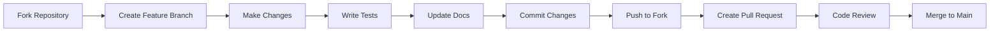

# 🤝 AUTARK Contributing Guide

*Gemeinsam vom Kies zum Mosaik - Beiträge, die das System stärken*

## 🎯 Willkommen bei AUTARK

Vielen Dank für Ihr Interesse, zu AUTARK beizutragen! Dieses Projekt lebt von der Gemeinschaft und jedem einzelnen Beitrag. Ob Code, Dokumentation, Feedback oder Ideen - jeder Beitrag zählt.

## 🚀 Schnelleinstieg

### 30-Sekunden-Start
1. **Repository forken** auf GitHub
2. **Issue auswählen** mit Label `good-first-issue`
3. **Änderungen vornehmen** in eigenem Branch
4. **Pull Request erstellen** mit klarer Beschreibung

### 5-Minuten-Setup
```bash
# Repository klonen
git clone https://github.com/statesflowwishes-sketch/autark.git
cd autark

# Development-Umgebung einrichten
python3 -m venv venv
source venv/bin/activate  # Linux/Mac
# oder: venv\Scripts\activate  # Windows

# Abhängigkeiten installieren
pip install -r requirements.txt
pip install -r requirements-dev.txt

# Tests ausführen
python -m pytest

# AUTARK starten
python3 autark_launcher.py demo
```

### 60-Minuten-Deep-Dive
- **Architektur verstehen**: [docs/atlas/architecture.md](../docs/atlas/architecture.md)
- **Code-Standards lernen**: [Quality Guidelines](#-qualitätsstandards)
- **Ersten PR erstellen**: [Pull Request Workflow](#-pull-request-workflow)

---

## 🗺️ Beitragstypen

### 🐛 Bug Fixes
**Was**: Fehler beheben, Stabilität verbessern
**Wo**: Issues mit Label `bug`
**Wie**: 
1. Bug reproduzieren
2. Test-Case schreiben
3. Fix implementieren
4. Dokumentation aktualisieren

### ✨ Features
**Was**: Neue Funktionalität hinzufügen
**Wo**: Issues mit Label `enhancement`
**Wie**:
1. Design-Diskussion im Issue
2. Feature-Branch erstellen
3. Implementierung mit Tests
4. Dokumentation erweitern

### 📚 Dokumentation
**Was**: Docs verbessern, Tutorials schreiben
**Wo**: Issues mit Label `documentation`
**Wie**:
1. Lücken identifizieren
2. Klarheit und Vollständigkeit prüfen
3. Beispiele und Tutorials hinzufügen
4. Glossar-Begriffe erweitern

### 🧪 Tests & Qualität
**Was**: Test-Coverage erhöhen, Code-Qualität verbessern
**Wo**: Issues mit Label `testing`
**Wie**:
1. Test-Coverage analysieren
2. Edge-Cases identifizieren
3. Unit/Integration-Tests schreiben
4. Performance-Tests erweitern

### 🎨 UI/UX
**Was**: Benutzeroberfläche verbessern
**Wo**: Issues mit Label `ui/ux`
**Wie**:
1. Usability-Probleme identifizieren
2. Barrierefreiheit verbessern
3. Visual Design optimieren
4. User-Testing durchführen

---

## 📋 Entwicklungsworkflow

### 🔄 Git-Workflow



### 🌿 Branch-Namenskonvention
```
feature/kurze-beschreibung
bugfix/issue-nummer-beschreibung
docs/bereich-verbesserung
refactor/komponente-name
```

**Beispiele**:
- `feature/video-ai-audio-extraction`
- `bugfix/launcher-port-check`
- `docs/knowledge-system-tutorial`
- `refactor/dashboard-components`

### 💬 Commit-Nachrichten
```
<typ>(<bereich>): <kurze beschreibung>

<detaillierte beschreibung>

Fixes #123
```

**Typen**: feat, fix, docs, style, refactor, test, chore
**Bereiche**: launcher, video-ai, akis, dashboard, docs

**Beispiele**:
```
feat(video-ai): add audio transcription support

Implements whisper-based audio transcription for video files.
Supports German and English with confidence scores.

Fixes #45
```

---

## 🎯 Good First Issues

### 🟢 Einfach (30 Minuten)
- **Documentation**: Typos korrigieren, Links aktualisieren
- **UI Polish**: Button-Styles, Farb-Konsistenz
- **Testing**: Simple Unit-Tests schreiben
- **Config**: Default-Werte optimieren

### 🟡 Mittel (2-4 Stunden)
- **Feature Enhancement**: Bestehende Features erweitern
- **Bug Fixes**: Reproduzierbare Bugs lösen
- **API Improvements**: REST-Endpunkte verbessern
- **Performance**: Kleine Optimierungen

### 🔴 Komplex (1-2 Tage)
- **New Components**: Vollständige Komponenten
- **Integration**: Externe Service-Anbindung
- **Architecture**: System-Design-Verbesserungen
- **Security**: Sicherheits-Features

### 🔍 Aktuelle Good First Issues

| Issue | Typ | Schwierigkeit | Geschätzt | Status |
|-------|-----|---------------|-----------|--------|
| [#12 - Add German UI translations](https://github.com/statesflowwishes-sketch/autark/issues/12) | i18n | 🟢 | 2h | Open |
| [#23 - Improve video upload progress](https://github.com/statesflowwishes-sketch/autark/issues/23) | ui/ux | 🟡 | 4h | Open |
| [#34 - Add health check endpoint](https://github.com/statesflowwishes-sketch/autark/issues/34) | api | 🟡 | 3h | Open |
| [#45 - Knowledge graph visualization](https://github.com/statesflowwishes-sketch/autark/issues/45) | feature | 🔴 | 2d | Open |

---

## ✅ Qualitätsstandards

### 🧪 Testing Requirements
```python
# Unit Tests
def test_launcher_demo_start():
    launcher = AutarkLauncher()
    result = launcher.start_demo()
    assert result is True
    assert launcher.check_port(8888) is True

# Integration Tests  
def test_video_ai_pipeline():
    video_path = "test_assets/sample.mp4"
    result = process_video(video_path)
    assert "transcript" in result
    assert "objects" in result
    assert result["duration"] > 0
```

### 📊 Code Quality Metrics
- **Test Coverage**: Minimum 80%
- **Complexity**: Cyclomatic < 10 pro Funktion
- **Documentation**: Alle öffentlichen APIs dokumentiert
- **Type Hints**: 100% für neue Python-Code

### 🔍 Code Review Checklist
- [ ] Tests vorhanden und bestehen
- [ ] Dokumentation aktualisiert
- [ ] Code-Style konsistent
- [ ] Keine Sicherheitslücken
- [ ] Performance akzeptabel
- [ ] Barrierefreiheit beachtet

### 🎨 Style Guidelines

**Python**:
```python
# Black Code Formatter
# PEP 8 Konventionen
# Type Hints für alle Parameter
def process_video(
    video_path: Path, 
    output_format: str = "json"
) -> Dict[str, Any]:
    """Process video and extract metadata.
    
    Args:
        video_path: Path to video file
        output_format: Output format (json, xml)
        
    Returns:
        Dict with video metadata
        
    Raises:
        VideoProcessingError: If processing fails
    """
```

**JavaScript/TypeScript**:
```typescript
// Prettier Code Formatter
// ESLint Rules
interface VideoMetadata {
  duration: number;
  transcript: string;
  objects: ObjectDetection[];
}

const processVideo = async (
  videoPath: string
): Promise<VideoMetadata> => {
  // Implementation
};
```

---

## 🔄 Pull Request Workflow

### 📝 PR-Template
```markdown
## Beschreibung
<!-- Was ändert dieser PR? -->

## Typ der Änderung
- [ ] Bug Fix
- [ ] New Feature
- [ ] Breaking Change
- [ ] Documentation Update

## Testing
- [ ] Tests hinzugefügt/aktualisiert
- [ ] Alle Tests bestehen
- [ ] Manual Testing durchgeführt

## Checklist
- [ ] Code follows style guidelines
- [ ] Self-review durchgeführt
- [ ] Dokumentation aktualisiert
- [ ] No breaking changes (oder Migration Guide)

## Screenshots
<!-- Bei UI-Änderungen -->

## Verknüpfte Issues
Fixes #123
```

### 🔍 Review Process
1. **Automated Checks**: CI/CD läuft automatisch
2. **Code Review**: Mindestens 1 Maintainer-Review
3. **Testing**: Manuelle Tests bei UI-Änderungen
4. **Documentation**: Docs-Review bei größeren Changes
5. **Merge**: Squash-Merge für saubere Historie

### ⚡ Review-Geschwindigkeit
- **Trivial** (Typos, Docs): < 24h
- **Small** (< 100 Zeilen): < 48h
- **Medium** (< 500 Zeilen): < 1 Woche
- **Large** (> 500 Zeilen): Nach Absprache

---

## 🎯 Spezielle Beitragsbereiche

### 🧠 AKIS Knowledge System
**Fokus**: Wissensmodellierung, Semantic Search
**Skills**: NLP, Graph Databases, Information Retrieval
**Einstieg**: [AKIS Documentation](../docs/atlas/knowledge.md)

### 🎬 Video-AI Pipeline
**Fokus**: Computer Vision, Audio Processing
**Skills**: OpenCV, PyTorch, Signal Processing
**Einstieg**: [Video-AI Guide](../docs/atlas/video-ai.md)

### 📊 Dashboard & Visualization
**Fokus**: Frontend, Data Visualization, UX
**Skills**: React/Vue.js, D3.js, CSS/SCSS
**Einstieg**: [Dashboard Setup](../tools/dashboard-builder.md)

### 🔧 Infrastructure & DevOps
**Fokus**: Deployment, Monitoring, Performance
**Skills**: Docker, CI/CD, System Administration
**Einstieg**: [Infrastructure Guide](../docs/setup/deployment.md)

---

## 🏆 Anerkennung & Rewards

### 🌟 Contributor Levels
- **Bronze**: 1-5 merged PRs
- **Silver**: 6-15 merged PRs
- **Gold**: 16+ merged PRs oder Major Feature
- **Platinum**: Core Maintainer

### 🎖️ Special Recognition
- **Documentation Hero**: Herausragende Docs-Beiträge
- **Bug Hunter**: Komplexe Bugs gefunden/gelöst
- **Feature Champion**: Innovative neue Features
- **Community Builder**: Aktive Hilfe im Community

### 📈 Contributors Dashboard
Aktuelle Top-Contributors und ihre Beiträge werden auf der [Contributors Page](./contributors.md) gewürdigt.

---

## 🆘 Hilfe & Support

### 💬 Community Channels
- **GitHub Discussions**: Allgemeine Fragen und Ideen
- **GitHub Issues**: Bug Reports und Feature Requests
- **Development Channel**: Für aktive Contributors
- **Documentation Discussions**: Docs-Verbesserungen

### 📚 Ressourcen
- **[Development Setup](../docs/setup/development.md)**: Lokale Entwicklungsumgebung
- **[Architecture Guide](../docs/atlas/architecture.md)**: System verstehen
- **[API Documentation](../docs/atlas/api-reference.md)**: Technische Referenz
- **[Testing Guide](../docs/testing/guidelines.md)**: Test-Best-Practices

### 🔧 Troubleshooting
**Häufige Probleme**:
- **Port bereits belegt**: `netstat -tulpn | grep :8888`
- **Dependencies fehlen**: `pip install -r requirements.txt`
- **Tests schlagen fehl**: `python -m pytest -v`
- **Code-Style-Errors**: `black . && flake8`

---

## 📄 Code of Conduct

Wir verpflichten uns zu einem **offenen und einladenden Umfeld** für alle, unabhängig von:
- Alter, Körpergröße, Behinderung, ethnischer Zugehörigkeit
- Geschlechtsidentität und -ausdruck, Erfahrungsstand
- Nationalität, persönlichem Aussehen, Rasse, Religion
- Sexueller Identität und Orientierung

**Erwartetes Verhalten**:
- Respektvolle und inklusive Sprache
- Offenheit für konstruktives Feedback
- Fokus auf das Beste für die Community
- Empathie gegenüber anderen Community-Mitgliedern

**Unakzeptables Verhalten**:
- Beleidigende, abwertende oder diskriminierende Kommentare
- Trolling, persönliche/politische Angriffe
- Öffentliches oder privates Harassment
- Veröffentlichung privater Informationen ohne Erlaubnis

**Durchsetzung**: Verstöße können zu temporären oder permanenten Sperren führen.

---

## 🔗 Nächste Schritte

- **🚀 [Good First Issues](./good-first-issues.md)** - Sofort loslegen
- **📋 [Code of Conduct](./code-of-conduct.md)** - Community-Standards
- **🔄 [Development Workflow](./workflow.md)** - Detaillierter Prozess
- **📊 [Quality Standards](./quality.md)** - Qualitätssicherung

---

*Gemeinsam verwandeln wir Kies in ein Mosaik - jeder Beitrag fügt eine wertvolle Kachel hinzu.*